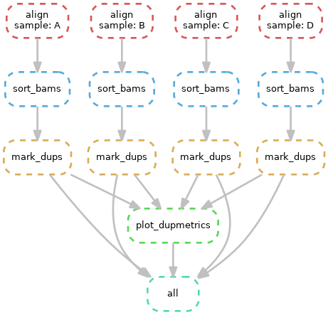

# Advanced Snakemake tutorial 
(Please read [Intro to snakemake](https://github.com/sraorao/snakemake_code_clinic) to become familiar with 
Snakemake first.)

This is code to build an example [Snakemake](https://snakemake.readthedocs.io/) workflow to process a set of Fastq files. 
We start with 4 fastq files, map each of them to the human genome with BWA, sort and index the bam files 
with Samtools, duplicate-mark them using GATK (Picard) and finally plot the duplicate metrics in a pdf. 
The Directed Acyclic Graph (DAG) of the workflow looks like this: 



## Example data
The original fastq files used here are from the European Nucleotide Archive Project number 
[PRJNA526724](https://www.ebi.ac.uk/ena/browser/view/PRJNA526724). However, to reduce processing time, only Read 1 from
 four samples are included, and further the reads were subset for only Chr 12 and down-sampled to 10% of the originals.

## Cluster profile
The profile code was originally written by [drjbarker](https://github.com/drjbarker/snakemake-gridengine), and I made 
the following modifications ([diffs](https://github.com/sraorao/snakemake-gridengine/commit/dadfcdff353d79a0ae897268e43096b8d8ccaadf)) to it:

- Logger warning turned off when the `sge-status` script can not find the job, because in my experience, this seems to 
be because `qacct` has not updated yet
- `cluster.yaml` and `sge-submit.py` have been edited to reflect common usage on the Oxford BMRC cluster (Rescomp). 
Importantly, `export-env` (`-V`) has been disabled as per 
[BMRC recommendations](https://www.medsci.ox.ac.uk/divisional-services/support-services-1/bmrc/cluster-usage/#submitting-jobs---step-by-step-guide-for-new-users). 
In addition, I have added a hostname option in `cluster.yaml` to specify node names.
- `sge-jobscript.sh` has been edited so that the Anaconda module can be loaded when Snakemake is using conda 
environments. This may conflict with any other environment modules loaded in individual rules.

This modified profile is included in this repo, but also available as [a fork of the original](https://github.com/sraorao/snakemake-gridengine).

## Conda vs. environments 
Conda is preferred to make a workflow more reproducible. However, on the BMRC cluster, due to a mixture of nodes with 
different CPU architectures, some jobs can fail because for example, the conda environment is built on Rescomp1 before 
job submission, and programs in this environment may then be incompatible with nodes C and D. When this happens, error 
messages like `Bus error`, `Illegal instruction` can be seen. See the 
[BMRC notes](https://www.medsci.ox.ac.uk/divisional-services/support-services-1/bmrc/r-and-rstudio-on-the-bmrc-cluster/#installing-local-r-packages) 
on this for more information. A workaround is to limit the job submission to the compatible nodes only.

Using environment modules gets around this problem, but at the cost of reproducibility. Hence it is a good idea to 
include _both_ `conda` and `envmodules` as recommended in the 
[Snakemake documentation](https://snakemake.readthedocs.io/en/stable/snakefiles/deployment.html#using-environment-modules).

## Configuration
Remember to edit `config.yaml` to change the `REF` to any other BWA indexed reference on your system.

## Cluster configuration
Change the `project` field in `profile/cluster.yaml` to your project name on the BMRC cluster.

## Run locally
To run the workflow locally, using 4 threads in total, type the following in the terminal:
``` 
$ snakemake -j 4 --use-conda --dry-run
```

## Run on the BMRC cluster

When running on the BMRC cluster, remember to set `--max-status-checks-per-second` to `0.01` as noted 
[in the Snakemake section here](https://www.medsci.ox.ac.uk/divisional-services/support-services-1/bmrc/scientific-software-directory/#s). 
```
$ snakemake -j 4 --use-envmodules --max-status-checks-per-second 0.01 --profile profile/ --dry-run
```
Note that here, `4` is the number of jobs submitted at a time. The number of threads (slots) allocated to each job is 
determined by `profile/cluster.yaml`.

## `Snakefile_cluster.smk`
This workflow shows how to run snakemake on the BMRC cluster:
```
$ snakemake --snakefile Snakefile_cluster.smk -j 1 --max-status-checks-per-second 0.01 --profile profile/ --dry-run
```
## `Snakefile`
This workflow shows how to run snakemake to process 4 fastq files to generate duplicate-marked bam files and 
plots of the duplicate metrics generated by Picard MarkDuplicates. It shows how to pass snakemake parameters 
to external scripts and uses conda environments and cluster environment modules.

Using Conda:
```
$ snakemake --snakefile Snakefile -j 4 --max-status-checks-per-second 0.01 --profile profile/ --use-conda --dry-run
```
Using BMRC environment modules
```
$ snakemake --snakefile Snakefile -j 4 --max-status-checks-per-second 0.01 --profile profile/ --use-envmodules --dry-run
```
Using both conda and BMRC environment modules
```
$ snakemake --snakefile Snakefile -j 4 --max-status-checks-per-second 0.01 --profile profile/ --use-conda --use-envmodules --dry-run
```
Conda will be used only for rules that don't define envmodules.

## `Snakefile_mergebams.smk`
This workflow illustrates how to construct a parameter sequence using python code. In this example, we need to generate 
a command for `gatk MergeSamFiles` which takes multiple bam files as input and outputs a single merged bam file. 
Simply using `I {input}` would result in a command with the input parameters as `-I A.bam B.bam C.bam D.bam`
whereas we want the input parameters to be parsed to `-I A.bam -I B.bam -I C.bam -I D.bam`. The latter can be achieved 
using the `join()` function in python.

```
$ snakemake --snakefile Snakefile_mergebams.smk -j 1 --max-status-checks-per-second 0.01 --profile profile/ --use-conda --dry-run
```

## `snakefile_inputfunc.smk`
Input functions can be used in place of filenames and returns a list or a dict. 
```
$ snakemake --snakefile Snakefile_mergebams.smk -j 1 --max-status-checks-per-second 0.01 --profile profile/ --use-conda --dry-run
```